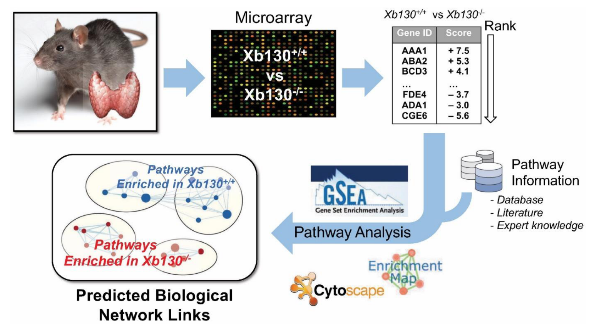

# [Thyroidal Transcriptomic Profiles of Pathoadaptive Responses to Congenital Hypothyroidism in XB130 Knockout Mice](https://doi.org/10.3390/cells11060975)

Junichi Sugihara,
	Aaron Wong,
	Hiroki Shimizu,
	Jinbo Zhao,
	Hae-Ra Cho,
	Yingchun Wang,
	Samuel Refetoffg,
	Peter Arvan,
	Mingyao Liu

Cells, 2022. (https://doi.org/10.3390/cells11060975)

## Abstract
Congenital hypothyroidism is a genetic condition in which the thyroid gland fails to produce sufficient thyroid hormone (TH), resulting in metabolic dysfunction and growth retardation. Xb130−/− mice exhibit perturbations of thyrocyte cytoskeleton and polarity, and develop postnatal transient growth retardation due to congenital hypothyroidism, leading ultimately to multinodular goiter. To determine the underlying mechanisms, we performed transcriptomic analyses on thyroid glands of mice at three age points: week 2 (W2, before visible growth retardation), W4 (at the nadir of growth); and W12 (immediately before full growth recovery). Using gene set enrichment analysis, we compared a defined set of thyroidal genes between Xb130+/+ and Xb130−/− mice to identify differentially enriched gene clusters. At the earliest postnatal stage (W2), the thyroid glands of Xb130−/− mice exhibited significantly downregulated gene clusters related to cellular metabolism, which continued to W4. Additionally, mutant thyroids at W4 and W12 showed upregulated gene clusters related to extracellular matrix, angiogenesis, and cell proliferation. At W12, despite nearly normal levels of serum TH and TSH and body size, a significantly large number of gene clusters related to inflammatory response were upregulated. Early postnatal TH deficiency may suppress cellular metabolism within the thyroid gland itself. Upregulation of genes related to extracellular matrix and angiogenesis may promote subsequent thyroid growth. Chronic inflammatory responses may contribute to the pathogenesis of multinodular goiter in later life. Some of the pathoadaptive responses of Xb130−/− mice may overlap with those from other mutations causing congenital hypothyroidism.

